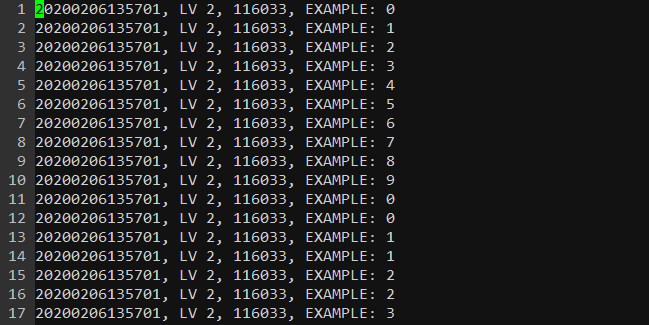

# EasyLog

A Simple & Easy Logging package for Go(golang). EasyLog is highly stable and thread-safe because it uses built-in [log](https://godoc.org/log) package in Go.

## Installation

``` bash
$ go get github.com/Astera-org/easylog
```

## Usage

``` go
package main

import (
	log "github.com/Astera-org/easylog"
)

func main() {
    // Initialize easylog
    if err := log.Init(
        log.SetLevel(log.DEBUG),				// set level to ouput
        log.SetFilePath("./"),					// set log file path
        log.SetFileName("easylog.log"),				// set log file name
        log.SetMaxSize(1),	// MB				// set max size of log files
    ); if err != nil {
        panic(err)
    }

    log.Info("Hello, easylog !")
}
```

If you initialize `easylog` in `func main()`, it allows you to write log with same logger from any file in your project that is importing `easylog` package.

### Level (default: DEBUG)

Five levels defined below.

- DEBUG (0)
- INFO (1)
- WARN (2)
- ERROR (3)
- FATAL (4)

You can set one of them for output level. Each function for levels allows you to output messages to level you want: `log.Debug()` `log.Info()` `log.Warn()` `log.Error()` `log.Fatal()`. The `log.Fatal()`, like built-in log package, outputs a message and then terminates the program.

### MaxSize (default: 1 MB)

You can set max size of log files in megabytes with `log.SetMaxSize()`. If log file exceed max size, the file will be changed to backup (`eg. sample.log.bak.20060102150405`) and create new one automatically.

### Log Format

Now, it is fixed at `[Time], [Level], [PID], [Message]` as below. It will be updated so that users can set it up soon.



## Example

You can run example code in `/examples`

``` bash
$ go run example1.go
## Within a short time after running, you can see the log file created.
```

